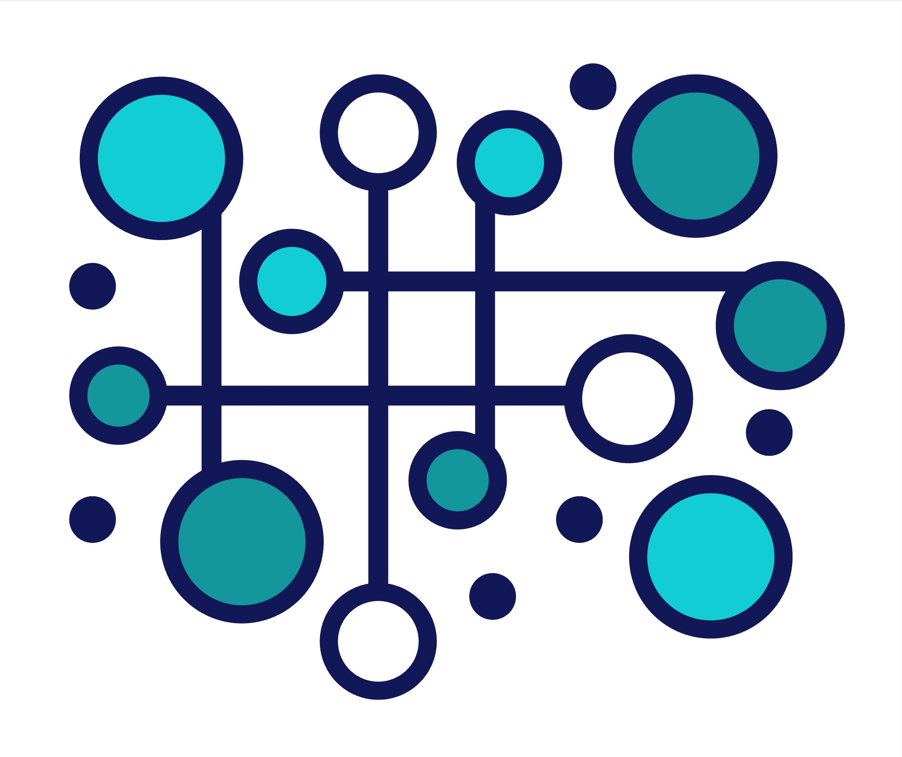
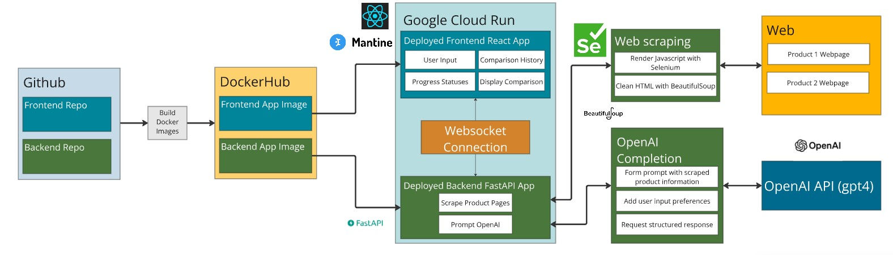

#  Quibble (Backend) - AI-Based Product Comparison Tool 

## Authors
- [D. Scott DiPerna](https://github.com/dscottd7)
- [Brendan Heinz](https://github.com/jbh14)
- [Xinrui Hou](https://github.com/superhermione)
- [Edward Mai](https://github.com/MaiEdward)

## Table of Contents
1. [Project Overview](#overview)
2. [Backend Features](#product_features)
3. [Quibble Architecture](#quibble_architecture)
4. [Backend Tech Stack](#tech_stack)
5. [Available Scripts](#scripts)
6. [Backend Walkthrough](#walkthrough)
7. [Future Enhancements](#future_enhancement)
8. [Citations](#citations)


## Project Overview
Quibble is an AI-powered product comparison tool designed to streamline the process of comparing two products. Users can enter URLs for products they wish to compare, along with their preferences for various comparison factors. The backend handles web scraping, data extraction, and OpenAI processing to produce an insightful, structured comparison.

The Quibble backend utilizes Selenium to scrape product information from the specified web pages and uses OpenAI to generate detailed comparison reports, highlighting key features, pros, cons, and essential factors. Then, the backend communicates with the frontend through WebSockets, ensuring a real-time, responsive user experience. Quibble frontend then presents this comparison report to assist the user making well-informed purchasing decisions.

This README provides a comprehensive guide to setting up and understanding the Quibble backend, which is built with FastAPI, Selenium, Websockets and deployed on Google Cloud. 
This application requires both the frontend and backend services to be running for proper functionality. 
- **You can access Quibble backend repo here: https://github.com/dscottd7/quibble-frontend**

## Backend Features
1. **AI-Generated Product Comparison**:
   - Processes two product URLs by scraping relevant product details.
   - Uses the OpenAI API to generate a structured comparison report, including pros, cons, and summary.
   
2. **Web Scraping with Selenium**:
   - Extracts detailed product information from provided URLs.
   - Handles complex website structures using Selenium to ensure accurate and comprehensive data retrieval.

3. **Real-time WebSocket Communication**:
   - Establishes a WebSocket connection with the frontend for real-time progress updates.
   - Sends updates on scraping, data analysis, and comparison generation.

4. **Customizable Comparison Factors**:
   - Accepts user preferences for specific categories (e.g., Price, Model, Features) to customize the comparison report generated by OpenAI.

5. **Structured Data Handling**:
   - Extracts structured product information for easy and consistent integration with the frontend.
   - Generates a detailed product comparison that includes product titles, pros, cons, and an overall summary.

6. **Scalable Backend Architecture**:
   - The backend is designed using FastAPI to handle multiple endpoints interacting with different services.
   - Implements asynchronous functions and efficient error handling to provide a robust and reliable backend service.


## Quibble Architecture


## Backend Tech Stack
- **Python & FastAPI: Backend API for handling requests, scraping, and OpenAI prompt services.**
- **Selenium: Web scraping tool to gather product information from URLs using web driver.**
- **OpenAI API: Used to generate product comparisons based on scraped data.**
- **WebSockets: Real-time communication between the backend and frontend.**
- **Swagger Hub: Adopted to test API endpoints and CRUD operations, including scraping and OpenAI services.**
- **Py test: Implemented to test API endpoints and backend functions** 
- **Google Cloud Platform: The application is deployed into Google Cloud though Docker Image**

## Available Scripts
1. Ensure you are using Python 3.12 or later. If you are using Python 3.11 or earlier, the "setuptools" requirement may not function correctly. 
2. You will need to create and provide an OpenAI API key to run this application locally.  After creating an OpenAI API key (https://platform.openai.com/docs/api-reference/authentication), make your key accessible by listing inside an `.env` file in your project directory as such:
```
OPENAI_API_KEY=<your-api-key>
```
3. Create and activate a virtual environment:
```
python3 -m venv .venv       # Mac/Linux
python -m venv .venv        # Windows

source .venv/bin/activate   # Mac/Linux
.\venv\Scripts\activate     # Windows
```
4. Install required dependencies:
```
pip install -r requirements.txt
```
5. Run the application:
```
uvicorn app.main:app --reload
```
6. Access Swagger for testing:
- Navigate to `http://127.0.0.1:8000/docs` in your browser to access the Swagger UI and test API routes (websockets will not appear there).

## Backend Walkthrough

* **Swagger API walkthrough** - visually presents the backend operation in Swagger


## Future Enhancements
- User Authentication: Allow users to log in and save comparisons to their account.
- Multiple Product Comparison: Extend functionality to allow comparison of more than two products at once.
- Database Integration: Store users' saved comparisons in a database instead of local storage to support multiple devices and permanent access.
- User Feedback and Ratings: Allow users to rate the quality of a generated comparison.
- Real-time Chatbot Assistant: Integrate a Quibble chatbot to guide users for navigating the site. 
- Product Visual Integration: Enhance the comparison feature by scraping product images from relevant websites and displaying them in an organized, visually appealing way.

## Citations
- FastAPI Official Documentation. https://fastapi.tiangolo.com/learn/ 
- Selenium with Python. https://selenium-python.readthedocs.io/ 
- Websockets Documentation. https://websockets.readthedocs.io/en/stable/ 
- Swagger Hub Documentation. https://swagger.io/docs/specification/v3_0/about/ 
- OpenAI (n.d.). API Reference. OpenAI. https://platform.openai.com/docs/overview 
- Google Cloud Deployment. https://cloud.google.com/sdk/gcloud/reference/app/deploy
- DockerHub. https://hub.docker.com/
